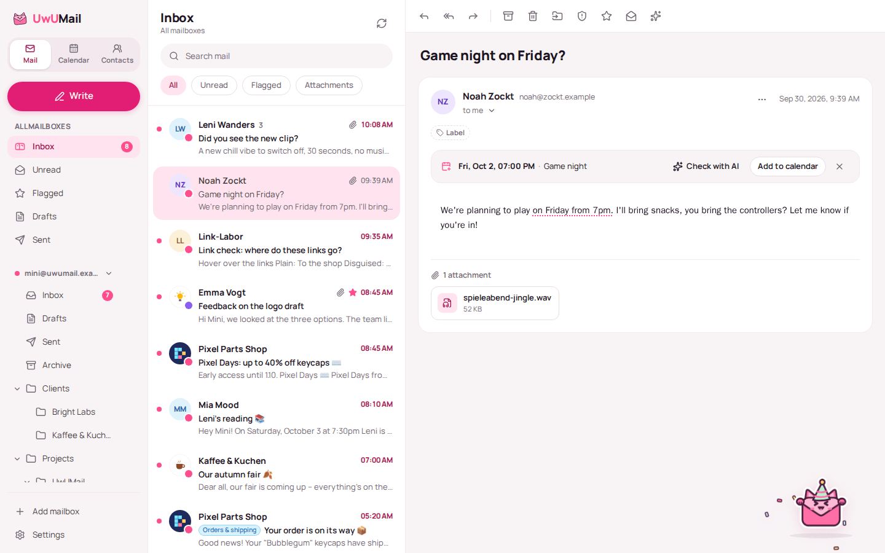
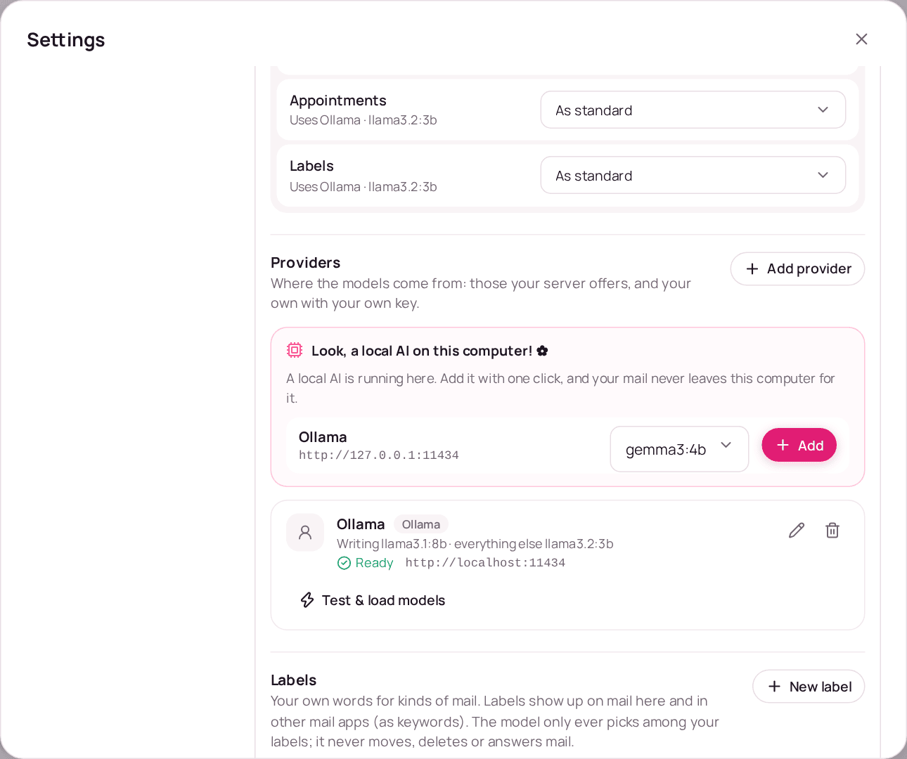
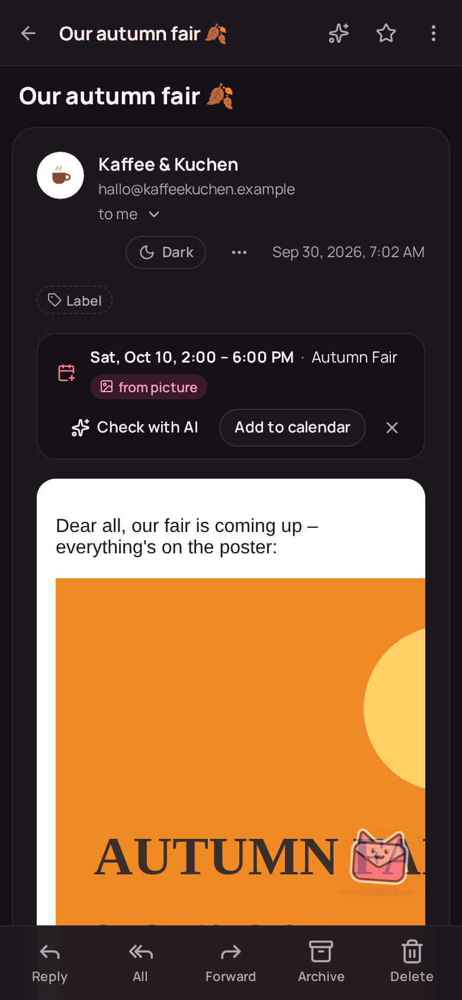

<p align="center">
  
</p>

<h1 align="center">UwUMail</h1>

<p align="center">
  The mail client I build for myself, because every other one annoyed me. (◕‿◕✿)<br/>
  IMAP · SMTP · JMAP · Windows · macOS · Linux · Android · iOS
</p>

<p align="center">
  
</p>

---

## Why this exists

I'm building UwUMail for myself. Every mail client and self-hosted mail server I
tried annoyed me in one way or another, so I started building my own, the way I
want it. The server half lives in
[UwUMail Server](https://github.com/MinifyX/UwUMail-Server).

- **Just for fun.** No company, no team, no schedule, no promises. I work on it
  when I have time and feel like it, so don't expect steady development, and
  don't be surprised by long breaks.
- **Written with AI.** Almost all of the code is written with Claude, because
  I'm honestly not a great programmer. Not your thing? No hard feelings, just
  pick something else.
- **Use it, fork it, do what you want with it.** The license only asks one
  thing: if you pass on a changed version, its source stays open too.
- **No support.** Issues and pull requests are okay, but I might answer late or
  not at all, and I mostly build what I need myself.

## What it is

UwUMail is an open-source mail app that works with any IMAP/SMTP mailbox and
speaks JMAP with servers that offer it (tested with Stalwart and UwUMail
Server). It's what I wanted from a mail client; the long version of every point
is in [docs/features.md](docs/features.md):

- **Simple or Pro.** A calm two-column layout or a dense three-column one with
  keyboard shortcuts, any time.
- **All your mailboxes** in one unified inbox. Setup needs only your address and
  password; Microsoft (Outlook.com and Microsoft 365, now on Android and iPhone
  too) and Google sign in with their own page.
- **Fast and offline.** Mail is cached locally with full-text search in
  milliseconds.
- **The everyday things.** Undo send, drafts that follow you to every device,
  signatures per address, one-click unsubscribe, link warnings.
- **Calendar, contacts and birthdays.** JMAP on UwUMail servers, CalDAV and
  CardDAV elsewhere, and a birthdays calendar with ages.
- **Appointments in mail.** Dates in the text and on pictures are underlined and
  go into the calendar prefilled; *Find appointment* asks the AI on a click.
- **An AI assistant, off until you set it up**: the server's for UwUMail
  mailboxes, your own providers for all others, a local Ollama or LM Studio in
  one click, and the tokens and cost before every click ([below](#ai-assistant)).
- **Private by default.** No telemetry, remote images blocked until you allow
  them and loaded without holding the mail up, an optional proxy, passwords in
  your system's keychain.
- **On the phone too.** Android and iPhone with swipes and an app lock; on
  Android, new mail can come through UnifiedPush.
- **Playful.** UwUMail talks to you with a wink, and Nyu reacts to what you do.
  Prefer it plain? Settings → Tone → Neutral, and Nyu can be reduced or off.

> **Status:** beta. It works, but expect rough edges and things that change.
> The [roadmap](docs/roadmap.md) shows what's done and what I'd like to do next.

| | |
| --- | --- |
|  |  |
| A local AI found on this computer, added with one click. | On the phone, in dark mode: the date came from the poster. |

## Download

Everything is on the
[releases page](https://github.com/MinifyX/UwUMail-Client/releases). I mostly
use it on Windows and Android; the other builds are tested automatically on
GitHub's machines, not by me every day.

| System | File |
| --- | --- |
| Windows (x64) | `UwUMail-windows-x64-setup.exe` |
| Windows on ARM | `UwUMail-windows-arm64-setup.exe` |
| macOS (Intel & Apple chip) | `UwUMail-macos-universal.dmg` |
| Ubuntu / Debian | `UwUMail-linux-x64.deb` · ARM: `UwUMail-linux-arm64.deb` |
| Fedora / openSUSE | `UwUMail-linux-x64.rpm` · ARM: `UwUMail-linux-arm64.rpm` |
| Arch Linux | AUR: `yay -S uwumail-bin` |
| Linux portable | `UwUMail-linux-x64-portable.tar.gz` · ARM: `UwUMail-linux-arm64-portable.tar.gz` |
| Android | `UwUMail-android.apk` |
| iPhone | `UwUMail-ios.ipa`, sideload only |

The names stay the same from release to release, so
`https://github.com/MinifyX/UwUMail-Client/releases/latest/download/<file>`
always gets the newest one.

On Windows and macOS the setup installs just for you, without an
administrator password, and UwUMail keeps itself up to date after that. On
Linux the .deb and .rpm install for everyone and update themselves too (asking
for the administrator password); the AUR package updates with pacman, and the
portable folder doesn't update at all. The Mac build isn't signed by Apple, so
macOS wants one extra click the first time. That, the Linux details and how to
uninstall are in [docs/install.md](docs/install.md). The iPhone build is
unsigned and has to be sideloaded; how that works, and what iOS doesn't allow,
is in [docs/ios.md](docs/ios.md).

## AI assistant

The assistant writes and rewrites mail, summarizes mails and conversations,
gives a second opinion on spam, finds appointments and puts your own labels on
new mail. It is off until you set it up, suggestions only go into a mail when
you click, labels only when you switched them on, and nothing is ever moved.

**Where it runs** depends on the mailbox:

- **Mailboxes on a UwUMail server** use the server's assistant. The admin sets
  up providers for everyone, some domains or some people, with daily limits in
  requests and tokens and a switch whether people see what it costs; people may
  add their own keys where the admin allows it. The server asks the model, the
  app never does ([server guide](https://github.com/MinifyX/UwUMail-Server/blob/main/docs/llm.md)).
- **All other mailboxes** use providers you set up on this device, under
  *Settings → AI assistant → This device*: OpenAI, Anthropic Claude (API keys
  only), Google Gemini, Mistral, OpenRouter, Ollama or any OpenAI-compatible
  server. Keys stay in the system's keychain, and requests go straight from
  your device to the provider.

**Local models.** When an Ollama (`127.0.0.1:11434`) or LM Studio
(`127.0.0.1:1234`) runs on the same computer, the settings offer it with one
click and a list of the installed models. Your mail then never leaves the
computer, and it costs nothing.

**Before you click**, hovering an AI button (a long press on the phone) shows
"≈ 1,200 tokens · ≈ €0.02 · 48,000 left today": the size of the request, its
cost where the price is known (always for your own providers, for a server's
only if its admin allows), and what is left of the server's daily limit.
Prices come from public price lists and the ECB's exchange rates, and can be
set by hand per provider.

**Privacy:** only the text a feature needs goes to the model, no attachments
and no pictures; the mail is data, not orders, and the model gets no tools.
For mail that must not leave the house, use a local model.

More in [docs/ai-assistant.md](docs/ai-assistant.md).

## Project layout

| Path | What lives there |
| --- | --- |
| `apps/desktop` | The Tauri 2 app for desktop, Android and iOS (React UI + Rust shell) |
| `apps/setup` | UwUMail's own installer, updater and uninstaller for Windows, macOS and Linux |
| `crates/uwumail-core` | Mail engine: accounts, IMAP and JMAP sync, sending, local store, search, the assistant |
| `crates/uwumail-android` | Android side of the engine: background service, keystore, notifications |
| `brand/` | Logo and icon sources |
| `docs/` | Features, vision, architecture, design system |
| `release-notes/` | "What's new" texts per version |

## Development

Requirements:

- Node.js 24 and pnpm 11 (`corepack enable`)
- Rust stable (via [rustup](https://rustup.rs))
- Platform prerequisites for Tauri: see
  [tauri.app/start/prerequisites](https://tauri.app/start/prerequisites/)
  (Windows: Visual Studio C++ Build Tools and WebView2)

```bash
pnpm install
pnpm tauri dev        # desktop app with the real mail engine
pnpm dev              # UI only, in the browser, with demo data
```

Checks:

```bash
pnpm typecheck && pnpm lint && pnpm test
cargo fmt --check && cargo clippy --all-targets && cargo test
```

Integration tests talk to a local test mail server:

```bash
docker compose -f dev/mailserver.compose.yml up -d
```

The screenshots in `docs/screenshots/` are taken from `pnpm dev` with its demo
data.

## Documentation

- [Features](docs/features.md) — everything UwUMail does, in detail
- [AI assistant](docs/ai-assistant.md) — where it runs, local models, estimates and costs, privacy
- [Vision](docs/vision.md) — what I want UwUMail to be and what it will never do
- [Installing](docs/install.md) — the setup on each system, first start on a Mac, updates, uninstalling
- [iPhone](docs/ios.md) — sideloading and what iOS doesn't allow
- [Microsoft and Google sign-in](docs/oauth.md) — client ids, redirects, Microsoft 365
- [Architecture](docs/architecture.md) — how the pieces fit together
- [Design](docs/design.md) — colors, type, tone of voice, and [Nyu's animations](docs/nyu-animations.md)
- [Roadmap](docs/roadmap.md) — my wish list, without dates
- [Contributing](CONTRIBUTING.md) — worth a look before you open an issue or a pull request
- [Security](SECURITY.md)

## License

UwUMail is free software under the [GNU GPL v3.0](LICENSE): use it, change it,
fork it, share it. If you pass on a changed version, its source has to stay
open too.
